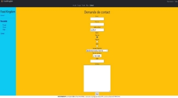
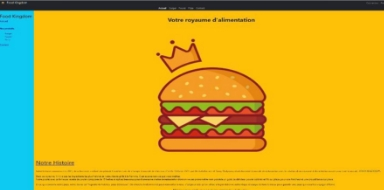
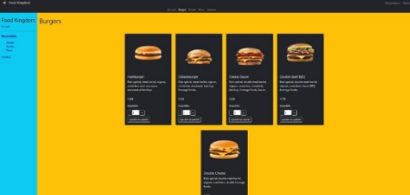
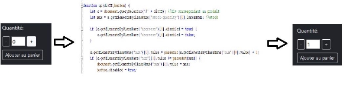
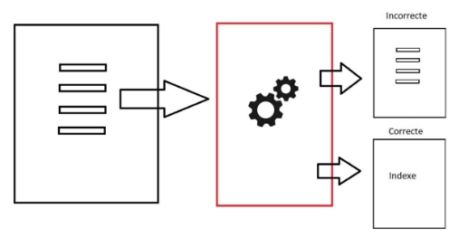
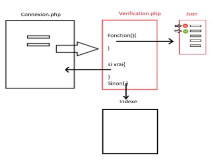
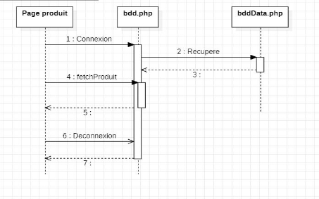
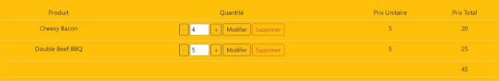



Mostafa **KASSEM** 

Tomy **Phalyvong  à l’attention de M. FREBOURG** 

**Groupe (GI 3B)** 

**Rendu Développement Web **

Sommaire 

[Introduction ................................................................................................................................... 3 ](#_page2_x69.00_y72.00)[Rendu HTML/CSS ........................................................................................................................ 4 ](#_page3_x69.00_y72.00)[Rendu JS DOM ............................................................................................................................. 6 ](#_page5_x69.00_y72.00)[1-  Le script stock .................................................................................................................... 6 ](#_page5_x69.00_y110.00)[2-  Le script formulaire ............................................................................................................. 6 ](#_page5_x69.00_y315.00)[Rendu PHP ................................................................................................................................... 7 ](#_page6_x69.00_y102.00)[1-  Insertion des variables de session ..................................................................................... 7 ](#_page6_x69.00_y136.00)[2-  Page produit ....................................................................................................................... 7 ](#_page6_x69.00_y360.00)[3-  Vérification formulaire ........................................................................................................ 7 ](#_page6_x69.00_y526.00)[4-  Connexion de l’utilisateur. .................................................................................................. 8 ](#_page7_x69.00_y334.00)[Rendu SQL AJAX ......................................................................................................................... 9 ](#_page8_x69.00_y72.00)[1-  Gestion de la base de données ......................................................................................... 9 ](#_page8_x69.00_y110.00)[1-  La Gestion du panier et Stock ............................................................................................ 9 ](#_page8_x69.00_y570.00)[Fonctionnalité Supplémentaire ................................................................................................... 10 ](#_page9_x69.00_y116.00)[Conclusion .................................................................................................................................. 10 ](#_page9_x69.00_y398.00)

Introduction 

Dans le cadre de notre notre projet d’étude nous présentons ici notre site à destination d’une chaîne de restauration rapide. Il s’agit bien évidemment d’une première version dans lequel nous avons laissé une structure capable d’être améliorée grâce à des Frameworks ou des API. 

Pour lancer le site, il suffit de lancer le fichier source FoodKingdom.sql qui créée la base de données et toutes les tables et puis se connecter sur localhost.  

Rendu HTML/CSS 

Au  niveau  du  design,  nous  nous  sommes  appuyés  sur  un  design  simple  et  harmonieux.  La thématique étant une chaîne de restauration nous avons décidé de mettre en avant les couleurs de l’enseigne 

Notre site répond également au besoin actuel en se voulant responsive. Celui-ci pourra donc s’adapter aux différentes tailles d’écran dont les plus petites. 

Concernant la page de contact, celle-ci est présente afin que les utilisateurs puissent écrire leur demande au webmaster du site. 

L’index se veut explicite quant au contenu que nous proposons. Nous y trouverons donc la présentation de l’entreprise. 

` `Voici donc une présentation générale du site. 

Concernant les différentes options que nous avons intégrées à notre site : 

La barre de navigation horizontale met en avant la page sur laquelle nous sommes présents, les autres liens redirigent l’utilisateur vers les autres pages de notre site. Le Framework Bootstrap nous a également permis un gain de temps sur la mise en forme et les effets visuels. 

La barre de navigation verticale intègre moins d'options graphiques que la barre de navigation horizontale. Cependant nous avons laissé cette option qui peut être potentiellement enlevée ou améliorée.  

Rendu JS DOM 

1-  Le script stock 

Les scripts de cette page seront activés à l'appui des boutons. Respectivement le bouton + et le bouton -. 

` `Ce que le script fait : Il va récupérer la valeur de la classe stock-quantité et va l’incrémenter ou la décrémenter en fonction de la fonction utilisée. Il va ensuite mettre à jour la valeur de l’input pour pouvoir éventuellement l’ajouter au panier.

2-  Le script formulaire 

Nous effectuons des vérifications supplémentaires avec des expressions régulières.

Pour cela nous récupérons les données rentrer dans le formulaire. Concernant les fonctions du script, ceux- ci  vérifient  avec  du  regex  que  la  chaîne  de  caractère  possède  certaines  caractéristiques.  Comme  La majuscule au début, ou la présence de caractères spéciaux. Puis le script modifie les propriétés de la page pour changer la couleur des bordures.

Si les propriétés sont respectées, le texte est valide est la case du formulaire apparaît en vert afin que l’utilisateur comprennent que la saisie est valide.

Autrement nous affichons un message à l’utilisateur correspondant au format demandé.

Rendu PHP 

1-  Insertion des variables de session 

Afin de factoriser le code la page produit et ainsi la générer pour les différentes catégories de produits, il est nécessaire de remplir dans un premier temps les variables de session avec les différentes données du site. Pour cela nous appelons donc le script « varSession.inc.php » dans le « header.php » qui est aussi inclus dans toutes les pages ce qui permet d’initialiser ces variables de session à la première connexion de l’utilisateur. 

Ces variables de sessions étaient d’abord initialisées manuellement avec des tableaux associatifs et puis éventuellement avec un fichier xml “cat.xml” qui retranscrit les informations du fichier dans les variables de session sachant que chaque indice correspond à une catégorie. 

Avant cette insertion, on vérifie que le fichier xml ne contient pas de nouvelles catégories, si c’est le cas, on crée une nouvelle variable de session qui correspond à cette nouvelle catégorie avant d’insérer les produits correspondants. 

2-  Page produit 

Les pages produits vont être appelées avec l’argument permettant de connaître la catégorie produit que nous souhaitons avoir. 

Cet argument nous permet de sélectionner le tableau associatif enregistré dans les variables de session.  

Il suffit donc d’effectuer une boucle afin d’obtenir les différents produits ainsi que leur caractéristique pour les afficher. Pour utiliser la bonne variable de session, on a fait un $\_GET[“cat”] au début de la page et on vérifie que cette valeur correspond à une catégorie avant d’effectuer cette boucle. Dans le cas où le $\_GET renvoie une catégorie qui n’existe pas, l’utilisateur aura une erreur 404. 

3-  Vérification formulaire 

Dans un premier temps, nous récupérons les informations du formulaire de contact puis nous les insérons dans des variables locales. Ceci nous permet de convertir notre jeu de données dans un format approprié. 

La seconde étape est de vérifier si ces champs sont vides. 

S’ils le sont alors nous redirigeons l’utilisateur vers le formulaire, il pourra réécrire sa requête. 

Si les champs du formulaire sont complets, alors nous effectuons la vérification des différents champs avec les expressions régulières correspondant. 

Si les informations ne correspondent pas au format demander alors l’utilisateur est redirigé vers la page du formulaire. Sinon il est redirigé vers l’index du site. 
PAGE7 

4-  Connexion de l’utilisateur. 

Pour cette partie il faut vérifier qu’il s’agit bien d’un utilisateur, pour cela nous devons récupérer les informations de connexion sur une page de type formulaire. 

Une fois ces informations il faut effectuer des vérifications. Pour cela nous récupérons les identifiants entrés dans le formulaire et comparons la base de données des utilisateurs qui est au format json. Le site redirige ensuite vers « index.php » en connectant l’utilisateur si les identifiants appartiennent à la base de données, sinon l’utilisateur est redirigé vers la page de connexion 

Une fois l’utilisateur connecté, le bouton de connexion est remplacé par un bouton de déconnexion afin que l’utilisateur puisse se déconnecter. 

 8 

Rendu SQL AJAX  

1-  Gestion de la base de données 

On a d’abord créé une BDD avec 3 tables : produit, panier et utilisateur. Ensuite on a migré la totalité du contenu du site dans la BDD qu’on utilise pour remplacer les variables de session utilisé dans les rendus précédant. On a aussi 2 scripts SQL, le premier « foodKingdom.sql » sert à initialisé la BDD, il faut l’appeler manuellement vu que c’était demandé dans l’énoncé du rendu 4. 

Le deuxième script est généré automatiquement à partir du fichier bdd.php qui contient toutes les fonctions liées à la BDD dont « insertionProduitDB() » qui lit le fichier xml et met son contenu dans la BDD et le deuxième script. 

Le fichier bddData.php contient toutes les informations de connexion à la BDD dont le mot de passe du root. Ce fichier est inclus à l’intérieur de la fonction connexion() ce qui ces informations inaccessibles autre part. 

Cette image détaille le   fonctionnement de  l’affichage de la page produit  avec la BDD  

1-  La Gestion du panier et Stock

La BDD contient une table pour le panier qui associe un panier à un utilisateur ce qui permet à un utilisateur de récupérer son panier à chaque connexion.

A l’ajout de produit, on utilise du ajax pour récupérer la valeur du stock et on la modifie à la fois dans la BDD sans avoir besoin de rafraîchir la page. 

Fonctionnalité Supplémentaire 

Le site contient plusieurs fonctionnalités supplémentaires : Le hachage des mots de passes avant leur insertion dans la BDD ce qui permet à mieux sécuriser les comptes  

On a ajouté aussi un attribut admin dans la BDD qui nous permet de vérifier si un utilisateur est un administrateur du site ou pas. S’il est admin, cet utilisateur pourra avec le bouton « Afficher Stock » accéder à la quantité du stock disponible. Ce bouton n’est pas visible par les autres utilisateurs. 

L’utilisation de la BDD pour la gestion des utilisateurs n’était pas demandé non plus, le fichier bdd.php contient la fonction insertUsers() qui permet d’insérer les utilisateurs dans la BDD à partir du fichier json créé au rendu précédant. Cette fonction est appelée uniquement la première fois qu’un utilisateur accède le site après vérification que la table utilisateur n’est pas déjà remplies. 

On peut aussi considérer le fait que le panier est sauvegardé pour chaque utilisateur comme une fonctionnalité supplémentaire. 

Conclusion 

Pour conclure, on peut considérer que le site est terminé par rapport à ce que le module demande. Le site peut toujours s’améliorer, cependant, avoir 4 rendus différents a rendu le travail plus difficile que nécessaire, on ne pouvait pas faire le frontend et le backend au même temps, la répartition des tâches était donc difficile à faire d’une manière équitable.  

On aurait préféré avoir un cahier de charge complet depuis le début qui détaillait les fonctionnalités demandées et avoir qu’un seul rendu. Cela nous aura donné plus du temps à intégrer davantage de fonctionnalité au lieu de mettre en place des fonctionnalités pour un rendu qu’on n’utilise pas pour le prochain. 

Le contexte sanitaire aussi a rendu le travail en équipe difficile, néanmoins, l’utilisation de git nous a beaucoup aidé à organiser le code. 
PAGE10 
